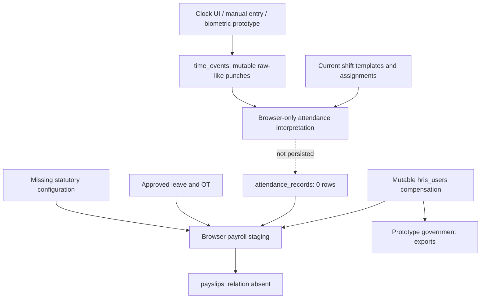

# Phase 0 Existing-System Audit

## 1. Scope and evidence

This audit covers the repository and the connected production Supabase project as observed on 2026-09-04. The code baseline is `origin/main` commit `2f10f51`. All production inspection was read-only and aggregate/catalog based; no personal payroll data was exported.

Evidence reviewed:

- 684 repository files, including 112 committed SQL migrations and 9 Edge Function directories
- React/Vite payroll, timekeeping, leave, overtime, reporting, user, audit, and permission code
- Live schemas, columns, constraints, views, functions, triggers, grants, RLS policies, storage policies, extensions, migration history, Edge Functions, and aggregate row counts
- Supabase security and performance advisors
- API and Postgres logs available for the preceding 24 hours
- Current official Philippine agency sources listed in the [policy register](./POLICY-REGISTER.md)
- Production build and the existing RBAC/time-approval smoke tests

Out of scope because access/evidence was not available:

- TNG's current HR manual, collective bargaining agreements, individual contracts, payroll calendars, benefit schedules, deduction authorizations, and approval delegations
- The approved payroll register, bank file, general-ledger posting, remittance returns, and source time file for a closed payroll
- Row-level production data inspection, authenticated role-by-role penetration testing, load testing, backup restoration, and legal opinion

The audit therefore establishes technical facts and decision requirements. It does not approve a statutory interpretation or business policy.

## 2. Overall conclusion

The connected system is **not a production payroll system yet**. It is an HRIS with live employee, request, and scheduling data plus payroll prototype screens. There is no live payroll-period, run, result-line, posting, adjustment, payment, or statutory rule-version relation, and there is no server-side payroll function or Edge Function.

The production gate is NO-GO until the stop-ship controls in this document are resolved and a parallel payroll reconciles to a formally approved baseline.

## 3. Architecture inventory

| Layer | Observed implementation | Payroll implication |
|---|---|---|
| Frontend | React 19, Vite 6, TypeScript, `@supabase/supabase-js` | Many calculations and access filters occur in the browser. TypeScript payroll models use JavaScript `number`. |
| Data API | Browser uses a publishable/anon Supabase key and public-schema tables/RPCs | No service-role credential was found in browser configuration, which is correct. Database authorization must remain authoritative. |
| Database | Supabase Postgres in `ap-northeast-1`; database timezone UTC | Timestamps are generally `timestamptz`; payroll date boundaries must explicitly use `Asia/Manila`. The only configured site uses `Asia/Manila`. |
| Edge Functions | 9 deployed functions; none performs payroll | There is no privileged, idempotent payroll orchestration endpoint. |
| Scheduling | `pg_cron` is not installed and no cron job catalog is present | No automated attendance close, accrual, payroll close, report generation, or retention job exists. |
| Storage | 17 buckets; leave, OT, and employee-document buckets are private | Leave and OT object policies are overly broad for authenticated users. No payroll evidence/snapshot bucket exists. |
| Schema migrations | 112 SQL files in Git; 142 entries in production history | Material drift prevents reproducible rebuilds and makes migration ordering unsafe. |
| Tests | Build plus static smoke tests for RBAC/workflows; no payroll result tests | Existing green tests do not validate money, tax, contribution, time interpretation, posting, or reconciliation. |

## 4. Live data snapshot

The counts below are diagnostic aggregates, not a payroll register.

| Area | Relation/metric | Observed |
|---|---|---:|
| Identity | `auth.users` | 150 |
| Employee master | `hris_users` | 150 |
| Employee master | active HRIS users | 144 |
| Organization | `business_units` | 8 |
| Organization | `departments` | 121 |
| Organization | `sites` | 1 |
| Scheduling | `shift_templates` | 19 |
| Scheduling | `shift_assignments` | 209 |
| Scheduling | duplicate employee/date assignment groups | 4 |
| Raw time | `time_events` | 0 |
| Interpreted time | `attendance_records` | 0 |
| Exceptions | `attendance_exceptions` | 0 |
| Leave | `leave_requests` | 76 |
| Leave | `leave_types` | 4 |
| Leave | `leave_policies` | 1 |
| Overtime | `ot_requests` | 241 |
| Overtime | approved requests without usable approved/requested hours | 64 |
| Holiday | `holidays` | 1 |
| Audit | `audit_logs` | 2,694 |
| Compensation evidence | PAN rows with `salary_from` snapshot | 5 |

### Employee payroll-input completeness

| Field | Missing rows | Current values observed |
|---|---:|---|
| `employment_status` | 25 | Contractual 17; Probationary 33; Regular 75 |
| `rate_type` | 24 | Daily 32; Monthly 94 |
| `rate_amount` | 24 | Mutable current numeric value |
| `salary_basic` | 24 | Mutable current numeric value |
| `tax_status` | 24 | Married 8; Single 118 |

The fields do not represent the separate dimensions required for employment status, worker classification, pay basis, and legal engagement. The meaning and continued relevance of `tax_status` must be confirmed with Finance/Tax; this audit does not assume marital status changes the applicable withholding formula.

## 5. Schema and rule audit

### 5.1 Organization and worker identity

`business_units` contains only `id`, `name`, `code`, `color`, and timestamps. It is not a legal-entity register and has no registered name, TIN, SSS, PhilHealth, Pag-IBIG, wage region, or reporting identity. `sites` adds location, geofence, BU, and timezone but not wage-order classification.

No relations exist for:

- legal entities
- wage regions
- cost centers
- payroll groups
- worker classifications
- effective-dated employment/organizational assignments

`hris_users` stores current BU, department, position, hire date, `employment_status`, `rate_type`, and tax/bank/government identifiers. It cannot answer “what was applicable on the earning date?” after a change.

The reporting line is stored as text. Most values currently resemble an HRIS user UUID, but at least one row is unresolved. Some RLS policies compare that text to a manager name, while others compare it to an ID. That inconsistency can produce silent over- or under-scoping.

### 5.2 Compensation

`hris_users` holds mutable current values for `rate_amount`, `salary_basic`, `salary_deminimis`, and `salary_reimbursable`. These are Postgres `numeric`, but most have no declared precision/scale and are mapped to JavaScript `number` in the frontend.

There is no general compensation history, component catalog, currency, effective period, reason, source document, approval, supersession, or payroll-use snapshot. Five PAN rows contain `salary_from` JSON, which is useful evidence for those particular actions but is not a complete compensation ledger.

The self-update RLS policy permits users to update their own `hris_users` row. A trigger protects selected security, salary, bank, and government-ID fields, but it does not protect all payroll-relevant classification inputs. The employment audit trigger records only position, hire date, and employment status—not rate, salary component, tax, or organizational history.

### 5.3 Scheduling and attendance

`shift_templates` stores current hours, break, grace, and flexibility settings without effective dates, source, approval, or version. `shift_assignments` is dated but has no uniqueness constraint on employee/date; four duplicate groups already exist.

`time_events` is the closest object to raw punches. It stores event timestamp, type, source, location, device/context fields, and anomaly tags. However:

- the employee-own RLS policy grants `ALL`, allowing an employee to update or delete their raw punches;
- no append-only or supersession trigger exists;
- no immutable ingestion batch, device sequence, source checksum, server-received timestamp, correction link, or trusted-clock indicator exists;
- deleting an employee cascades to their time events;
- the client clock ignores the timestamp supplied by a caller and writes browser `now`;
- duplicate/sequence checks occur only in client state;
- a user-triggered stale-shift function inserts a clock-out exactly eight hours after the last clock-in.

`DailyTimeReview.tsx` does not read or write `attendance_records`. It groups events in browser memory, takes first “in” and last “out,” calculates elapsed time, sets break and OT to zero, and discards the interpretation on reload. It also expects `scheduled_start` and `scheduled_end` on `shift_assignments`, but those columns do not exist; the actual template must be joined.

`DailyRecordModal.tsx` appends manual clock-in/out events rather than creating a correction that explicitly supersedes source punches. This can change first/last-event interpretation without a deterministic resolution rule.

Most critically, `BiometricsUpload.tsx` does not parse the selected file. It generates random clock-in/out records for the first five users over the previous three days and attempts to insert them as biometric events. This must not be available in any production workflow.

`attendance_records` has derived fields for scheduled and worked time, lateness, undertime, OT, holidays, exceptions, manual status, and review status. It has no source lineage, interpretation/rule version, close/finalization record, or unique employee/date constraint. It currently contains zero rows.

### 5.4 Leave and overtime

Leave and OT approval requests have useful workflow fields and transition triggers, including direct-manager snapshots and conditional approval routing. Existing smoke tests cover those transitions. They do not provide payroll consumption, effective-dated policy, balance-ledger, or closed-period controls.

Specific gaps:

- `leave_policies` is a mutable current row with no effective period, version, authority, requester/approver, or test approval.
- Updating a leave policy overwrites the row.
- Approving leave reads a current quota from `hris_users`, subtracts in the browser, then overwrites the balance. The request approval and balance change are not one transaction.
- Leave-credit administration can set balances directly and batch-updates employees one request at a time.
- Offset-OT conversion reads a balance, adds `approved_hours / 8`, updates it, and only then marks the OT converted. Concurrent or partially failed calls can lose or duplicate value.
- The eight-hour conversion divisor is hardcoded.
- 64 approved OT records lack a usable hours value.
- Requested/approved OT is not reconciled to worked time events or finalized attendance.
- Deletion methods exist for OT requests, and employee deletion cascades to OT and leave requests.
- Deleting a leave type cascades to its policy, although historical policy definitions should be preserved.

### 5.5 Payroll relations and engine

The frontend references the following payroll relations, all of which are absent from the live catalog:

| Referenced relation | Used for | Catalog conclusion |
|---|---|---|
| `payslips` | payroll results and employee payslips | Absent |
| `government_reports` | report inventory/status | Absent |
| `government_report_templates` | report templates | Absent |
| `final_pay_records` | final-pay history | Absent |
| `sss_table` | contribution configuration | Absent |
| `philhealth_config` | contribution configuration | Absent |
| `tax_table` | withholding configuration | Absent |
| `holiday_policies` | premium configuration | Absent |

There are also no equivalent payroll views, Postgres functions, Edge Functions, or differently named run/result tables. Do not create these legacy shapes merely to silence the UI; they do not meet the required controls.

The routed `/payroll/staging` implementation:

- downloads users and all attendance records to the browser;
- includes only users whose single role is `Employee`, excluding covered managers and other workers;
- derives daily-paid hourly rate by dividing by 8 and monthly-paid rate by hardcoded 176;
- pays regular hours only;
- sets OT, holiday, night differential, SSS, PhilHealth, Pag-IBIG, and withholding tax to zero;
- permits free-form allowance and deduction changes;
- uses `parseFloat` and JavaScript floating-point arithmetic;
- represents “lock” only in React state;
- loops over employees and performs one insert request per payslip.

An unrouted `PayslipStaging.tsx` implements a second, conflicting algorithm with hardcoded regular and OT rates. Retaining two calculators without an authoritative engine is a regression risk.

`savePayslip()` would update an existing result in place, including its status and money fields. `Payslips.tsx` uses that method to publish and unpublish, and mass publication loops over rows. There is no posted-period immutability, idempotency key, batch transaction, line provenance, approval separation, payment state, or correction transaction.

`fetchPhilHealthConfig()` silently returns hardcoded fallback values on any database error. The configuration page also starts from a hardcoded fallback, converts inputs with `parseFloat`, and its Save button writes only an audit message—not configuration data. A connectivity/RLS/schema failure could therefore look like an approved rate.

### 5.6 Final pay and government reports

The final-pay screen fails while loading the absent `final_pay_records` table. Its calculator is client-only and uses a hardcoded 261-day divisor, derives 13th-month pay from calendar month number and current monthly salary, accepts arbitrary deductions, and does not persist an approval. “Approve & Lock” is local React state. The output displays a dollar symbol.

The government-report list and templates fail on absent relations. The detail screen then constructs forms from current employee master data rather than posted payroll snapshots. Its 13th-month report assumes 12 months for every active employee. The “Alphalist XML” multiplies current monthly salary by 12 and sets tax withheld to zero; it has no BIR schema/version validation. The SSS R-1A display expects legal/employer fields that do not exist in the live `business_units` schema and contains hardcoded placeholder/signatory data.

Available report/export surfaces are:

- daily time summary CSV from `attendance_records` (currently empty);
- attendance exceptions CSV from `attendance_exceptions` (currently empty);
- clock-log CSV, capped in the UI at 10,000 rows;
- approved-OT CSV/clipboard export, with every OT currently categorized as weekday;
- printable payslip UI against the absent payslip relation;
- mock/prototype government form and XML output.

None is an auditable statutory or payroll-control report today.

## 6. Current data-flow map

There is no durable chain from a raw punch to an interpreted day, earning line, deduction line, net pay, approval, posting, payment, statutory report, and general-ledger entry. The future target flow and cutover sequence are in [MIGRATION-AND-ROLLBACK-PLAN.md](./MIGRATION-AND-ROLLBACK-PLAN.md).

## 7. Permissions, RLS, audit, and storage

### Positive controls already present

- Public-schema tables reviewed have RLS enabled.
- The two public views use `security_invoker = true`.
- Browser configuration contains only the Supabase URL and publishable/anon key; no service-role secret was found.
- Sensitive employee fields have a database trigger in addition to UI permission checks.
- Leave and OT workflow transition triggers exist.
- The `employee-documents` bucket uses employee-folder and document-record checks.

### Material gaps

1. `time_events` grants an employee `ALL` on their own records. Raw source evidence is not immutable.
2. The general `hris_users` self-update policy plus an incomplete field guard allows changes to some payroll-relevant employment/classification fields.
3. Payroll resource grants are broad and do not encode segregation of duties. HR Manager and Board roles have create/edit/approve/finalize/manage/publish on the same high-risk resources; self-approval is not structurally prohibited.
4. The Final Pay and Payroll resources grant view access to Employee and multiple management roles, while the route relies primarily on authentication and frontend filtering. Future payroll tables must not inherit these assumptions.
5. `PayrollPrep.tsx` checks resource `PayrollPrep`, while the database resource is named `PayrollPreparation`; this can silently hide controls and demonstrates identifier drift.
6. Some timekeeping RLS policies expect `BusinessUnitManager`, but the live role is `Business Unit Manager`; some manager policies compare `reports_to` to a name although production values mostly hold IDs.
7. Broad table grants rely heavily on RLS rather than least-privilege grants.
8. Any authenticated user can select every object in the OT attachment bucket and insert into it without a request/path ownership condition. The leave attachment bucket has the same broad read/insert pattern and uses deprecated `auth.role()` checks.
9. Any authenticated session can insert an `audit_logs` row. Audit rows have no immutability trigger, actor/session attestation, hash chain, or protected event writer.
10. `private.rbac_migration_snapshots` has RLS disabled. Direct privilege checks showed no `USAGE` or DML grants to API roles, so it is not currently exposed through the Data API, but it remains a defense-in-depth finding.
11. No payroll-specific RLS, storage, or RPC exists because the payroll objects do not exist.

### Supabase advisor snapshot

| Advisor | Findings | Relevant interpretation |
|---|---:|---|
| Security | 113 | 12 mutable function search paths; 1 anonymous-callable and 95 authenticated-callable `SECURITY DEFINER` functions; 4 RLS/no-policy informational findings; leaked-password protection disabled. Each function requires authorization review; a linter finding is not by itself proof of exploitability. |
| Performance | 306 | 101 unindexed foreign keys; 14 RLS init-plan findings; 107 multiple-permissive-policy findings; 81 unused indexes; 2 duplicate indexes; 1 Auth connection advisory. Payroll-source foreign keys and RLS paths need targeted indexes after workload design. Do not delete indexes solely because they are currently unused. |

Remediation references: [RLS](https://supabase.com/docs/guides/database/postgres/row-level-security), [database linter](https://supabase.com/docs/guides/database/database-linter), [anonymous security-definer execution](https://supabase.com/docs/guides/database/database-linter?lint=0028_anon_security_definer_function_executable), [authenticated security-definer execution](https://supabase.com/docs/guides/database/database-linter?lint=0029_authenticated_security_definer_function_executable), and [unindexed foreign keys](https://supabase.com/docs/guides/database/database-linter?lint=0001_unindexed_foreign_keys).

## 8. “Missing table” root-cause analysis

The payroll errors are catalog absence, not a stale PostgREST cache and not merely RLS denial.

Evidence:

- `to_regclass('public.<name>')` returned null for all eight payroll relations.
- No relation, view, function, or Edge Function provides an equivalent payroll object.
- The frontend directly issues `.from('<missing-name>')` calls in `services/payrollService.ts`.
- The available 24-hour API/Postgres logs did not show a payroll relation or schema-cache error, but absence from logs only means those routes may not have been exercised in that window.
- The production build succeeds because Supabase relation names are runtime strings; Vite does not validate them against the database.

Other runtime relation strings that are also absent include `asset_repairs`, `calendar_events`, `change_history`, `device_binds`, `employee_drafts`, `job_post_visual_templates`, `profiles`, and `question_sets`. They are outside the payroll modernization scope, except `profiles`: `ManagerPinAuth.tsx` queries it for a client-side manager PIN, so manual clock authorization is currently non-functional and would be insecure even if that legacy table were added.

Root-cause rule: before adding any relation, determine whether the calling feature is valid, define the controlled target model, and reconcile the migration ledger. Do not restore prototype table names simply to make screens load.

## 9. Migration and production dependency audit

Production records 142 migrations; Git contains 112 files. Comparing normalized names gives 50 production-only names and 20 repository-only names. Some differences are renamed/prefixed equivalents, but foundational live migrations—including timekeeping creation and its initial RLS—are not committed.

The exact name comparison is recorded in [MIGRATION-DRIFT-APPENDIX.md](./MIGRATION-DRIFT-APPENDIX.md).

Consequences:

- a clean environment built from Git will not reproduce production;
- a future migration may assume an object or policy state that differs between environments;
- rollback cannot be trusted until the actual production schema is captured and diffed;
- an error cannot safely be diagnosed from repository SQL alone.

Existing HRIS data dependencies that must be preserved include all 150 employee records and their recruitment, document, request, approval, disciplinary, evaluation, award, PAN, resignation/offboarding, and audit references. Several payroll-source foreign keys currently use `ON DELETE CASCADE` from employee to `time_events`, `shift_assignments`, `leave_requests`, `ot_requests`, and `pans`. Those rules conflict with historical preservation once a record is payroll-referenced.

The detailed reconciliation and rollback process is in [MIGRATION-AND-ROLLBACK-PLAN.md](./MIGRATION-AND-ROLLBACK-PLAN.md).

## 10. Payroll gap and risk register

Scale: impact `Critical` means a credible path to incorrect pay, unrecoverable evidence loss, unauthorized sensitive access, or unlawful reporting; likelihood reflects the current implementation and data.

| ID | Risk | Impact | Likelihood | Required containment/control | Owner |
|---|---|---|---|---|---|
| R-01 | Payroll relations and server engine do not exist | Critical | Certain | Keep payroll generation/report routes non-production; approve target model before DDL | Product + Engineering |
| R-02 | Browser computes money with hardcoded/incomplete rules | Critical | Certain | No production payroll from frontend; deterministic server-side batch engine using exact numeric | Engineering + Finance |
| R-03 | No period close, posting, immutable result, reversal, or adjustment model | Critical | Certain | Define state machine; deny in-place changes after lock/post; correction transaction types only | Finance + Engineering |
| R-04 | Compensation/classification/schedule/tax inputs are not effective-dated | Critical | Certain | Introduce append-only versions and snapshot selected version IDs into payroll | HR + Finance |
| R-05 | Statutory configuration is absent and PhilHealth has silent hardcoded fallback | Critical | Certain | Remove fallback from production path; approved effective-dated rule packages with sources/tests | Finance/Tax + Legal |
| R-06 | Biometric “import” fabricates random punches | Critical | Possible on use | Disable route/control immediately; require parsed rows, preview, checksum, idempotent batch and rejection report | HR Ops + Engineering |
| R-07 | Employees can update/delete raw time events | Critical | Possible | Append-only raw store; separate correction facts; restrictive grants/RLS and audit | Security + Engineering |
| R-08 | Attendance interpretation is browser-only, non-versioned, and not persisted | Critical | Certain | Server-side set-based interpretation with lineage, exception queue, close state and rerun version | HR Ops + Engineering |
| R-09 | Overnight/broken/flexible shifts, breaks, holidays, and Manila date boundaries are not correctly modeled | Critical | Likely | Approve policies and scenario suite; explicit site timezone and local-date derivation | HR + Legal + Engineering |
| R-10 | Leave and offset balances can be lost/doubled by non-atomic overwrites | High | Likely | Append-only balance ledger; idempotent database transaction; never mutate balance directly | HR + Engineering |
| R-11 | Approved OT is incomplete and not reconciled to actual work | Critical | Likely | Exception queue; separate requested/approved/worked/payable quantities and rule/version | HR + Payroll |
| R-12 | Cascading deletes can destroy payroll source evidence | Critical | Possible | Prevent deletion once referenced; deactivate/supersede; `RESTRICT`/soft lifecycle | Data + Security |
| R-13 | Broad role grants allow the same role to prepare, edit, approve, and publish | Critical | Likely | Maker-checker by user identity; no self-approval; approval authority/effective delegation | Finance + Security |
| R-14 | Payroll and time access relies on inconsistent role/resource identifiers | High | Likely | Canonical role IDs; DB-enforced scopes; role-by-role integration tests | Security + Engineering |
| R-15 | Leave/OT attachments are readable bucket-wide by authenticated users | High | Likely | Request-linked object path policies and explicit reviewer scope; log downloads | Privacy + Security |
| R-16 | Audit records can be client-authored and are mutable evidence | High | Likely | Trusted server/database event writer, append-only controls, immutable snapshots and correlation IDs | Internal Audit + Security |
| R-17 | Government output uses current employee data, placeholders, and zero tax | Critical | Certain | Disable filing use; versioned agency templates and validation from posted payroll snapshots | Finance/Tax |
| R-18 | 24–25 employees lack key compensation/status/tax inputs | Critical | Certain | Data-quality gate; no silent zero; owned exception resolution with effective date/evidence | HR + Payroll |
| R-19 | Frontend loops and unfiltered reads will not scale or transact atomically | High | Certain | One idempotent batch command; set-based SQL/worker execution; indexes and query plans | Engineering |
| R-20 | No payroll-specific regression, property, rounding, authorization, or reconciliation tests | Critical | Certain | Approved scenario corpus and golden results before rule activation | Finance + QA |
| R-21 | Repository and production migration histories diverge | Critical | Certain | Schema-only capture, ledger mapping, clean rebuild and restore rehearsal first | DBA + Engineering |
| R-22 | No authoritative closed-payroll baseline is available in Supabase | Critical | Certain | Finance-controlled export package, checksums, control totals and sign-off | Finance/Internal Audit |
| R-23 | Retention, access purpose, and disposal rules are undocumented | High | Likely | DPO-approved retention schedule and privacy impact assessment | DPO + Legal |
| R-24 | No automated close/accrual/report/retention scheduler exists | High | Certain | Design idempotent monitored jobs after policy approval; manual controlled fallback | Payroll Ops + Engineering |

## 11. Decisions requiring confirmation

No item below may be inferred from current code. Each must be documented in the [policy register](./POLICY-REGISTER.md), supported by a source, reviewed with test scenarios, and approved before activation.

### HR

- Separate employment status, worker classification, pay basis, and legal engagement for every worker.
- Workweek, scheduled workdays, shift variants, grace, rounding, breaks, lateness, undertime, attendance corrections, and exception deadlines.
- OT eligibility by classification, approval stages, payable versus offset rules, and actual-work reconciliation.
- Leave entitlement, accrual, exhaustion order, negative balance, carryover, forfeiture, conversion, and final-pay treatment.
- Effective dating for organizational assignment, schedule, classification, and compensation changes.

### Finance/Payroll/Tax

- Legal employing entities and agency registration identities for all eight business units.
- Payroll groups, frequency, cutoffs, attendance close, adjustment deadline, pay date, and off-cycle rules.
- Salary divisor and proration for each pay basis and worker class.
- Earning/deduction component catalog, taxable/contribution bases, rounding order, deduction priority, minimum-net-pay handling, loans/accountabilities, and negative net handling.
- Statutory table source, effectivity, retroactive issuance handling, remittance/report schedules, year-end adjustment, and reissue/payment controls.
- Posted payroll approval authority, bank-file authority, GL mapping, reconciliation tolerances, and retention of evidence.

### Legal/Compliance and DPO

- Applicability/exclusions for hours-of-work premiums, managerial classifications, contractors, project/fixed-term/part-time workers, and regional wage orders.
- Holiday/rest-day combinations, paid/unpaid absence effects, leave conversion, 13th-month basis, final-pay inclusions/deadlines, and lawful deduction authorization.
- Privacy notice, lawful basis, access purpose, biometric/GPS/photo proportionality, data-subject handling, storage location, retention, disposal, breach response, and processor agreements.
- Government report format/version and legal record-retention requirements.

### Security/Internal Audit

- Segregation-of-duties matrix and prohibited user combinations.
- Strong authentication/MFA requirement for policy activation, payroll approval, posting, bank release, reversal, and reissue.
- Emergency/break-glass process, delegated authority, expiry, and retrospective review.
- Audit evidence standard, export/download logging, cryptographic checksums, and independent reconciliation.

## 12. Validation performed

| Check | Result |
|---|---|
| `npm ci` | Passed; dependency deprecation warnings recorded |
| `npm run build` | Passed; Vite warns `/index.css` is unresolved at build time |
| `npm run test:rbac` | Passed static smoke test |
| `npm run test:approvals` | Passed 41/41 static checks |
| `npm run test:conditional-approvals` | Passed |
| `npm run test:direct-manager-approvals` | Passed |
| Payroll calculation tests | None exist |
| Production writes | None performed |

## 13. Phase 0 exit status

Technical discovery is complete for the accessible artifacts. Phase 0 cannot be signed off as ready for implementation until:

1. owners approve or explicitly defer every P0 decision in the policy register;
2. Finance supplies and signs the closed-payroll baseline package;
3. the production schema/migration ledger is captured and a clean rebuild is proven;
4. critical prototype entry points are contained;
5. Legal/DPO confirms the statutory and privacy source set;
6. a Phase 1 design review accepts the target data model, security boundaries, and acceptance tests.
